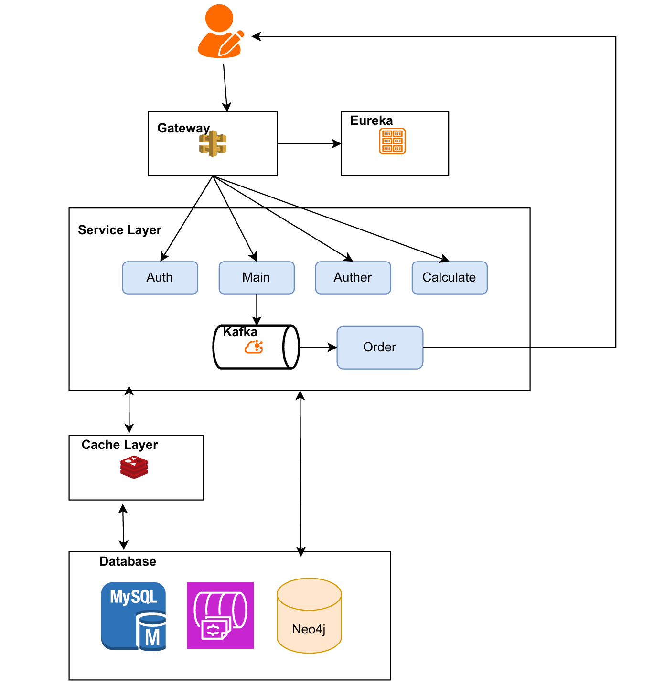

# Web Bookstore - Spring Boot Backend

This repository contains the backend implementation of a web bookstore application built with **Spring Boot**. The project is designed to handle a variety of functionalities, including user authentication, image storage, complex relationship queries, caching, and asynchronous processing. It leverages multiple technologies to ensure scalability, performance, and maintainability.

---
## Architecture Diagram

## Key Features

### 1. **User Authentication and Security**
   - **Spring Security** is integrated for robust user authentication and authorization.
   - **JWT (JSON Web Token)** is used for secure and stateless user sessions.

### 2. **Database Management**
   - **MySQL** is the primary relational database for storing structured data such as user information, books, and orders.
   - **MongoDB** is utilized as a NoSQL database for efficient storage and retrieval of image resources, ensuring high performance for media-heavy operations.
   - **Neo4j** is integrated to handle complex tag relationships, avoiding expensive `JOIN` operations in MySQL and enabling efficient graph-based queries.

### 3. **Caching for Performance Optimization**
   - **Redis** is employed to cache frequently accessed book information, significantly improving response times for hotspot data.
   - Strategies like **delayed double deletion** are implemented to maintain consistency between the cache and the database.

### 4. **Asynchronous Processing with Kafka**
   - **Apache Kafka** is used as a message queue to decouple the order processing service from the controller, enhancing system throughput and scalability.
   - Real-time updates on order status are sent to the frontend via **WebSocket**, ensuring a seamless user experience.

### 5. **Microservices Architecture**
   - The system is designed as a **Spring Cloud** microservices architecture.
   - Microservices register with **Eureka** for service discovery, while **Spring Gateway** handles request routing, enabling decoupling and health monitoring.
   - Each microservice is **containerized using Docker**, simplifying deployment, scaling, and updates.

---

## Architecture Overview

The application is structured into multiple layers and components:
1. **Authentication Layer**: Handles user login, registration, and JWT token management.
2. **Data Layer**: Manages data storage and retrieval using MySQL, MongoDB, and Neo4j.
3. **Caching Layer**: Utilizes Redis to cache frequently accessed data.
4. **Messaging Layer**: Implements Kafka for asynchronous order processing.
5. **API Gateway**: Routes requests to the appropriate microservices.
6. **WebSocket Integration**: Provides real-time updates to the frontend.
7. **Containerization**: Docker is used to deploy and manage microservices.

---

## Technologies Used
- **Spring Boot**: Core framework for building the application.
- **Spring Security**: For authentication and authorization.
- **MySQL**: Relational database for structured data.
- **MongoDB**: NoSQL database for image storage.
- **Neo4j**: Graph database for complex relationship queries.
- **Redis**: In-memory caching for performance optimization.
- **Apache Kafka**: Message queue for asynchronous processing.
- **WebSocket**: Real-time communication with the frontend.
- **Spring Cloud**: Microservices architecture and service discovery.
- **Docker**: Containerization for deployment and scaling.

---

## Documentation
For detailed information on the project basic functionalities, refer to the [requirement.pdf](./requirement.pdf) file in the repository.

---

## Contributing
Contributions are welcome! Please follow these steps:
1. Fork the repository.
2. Create a new branch for your feature or bugfix.
3. Submit a pull request.

---

## License
This project is licensed under the MIT License. See the [LICENSE](./LICENSE) file for details.

---

Good luck to you in the Web Bookstore project! 🚀
